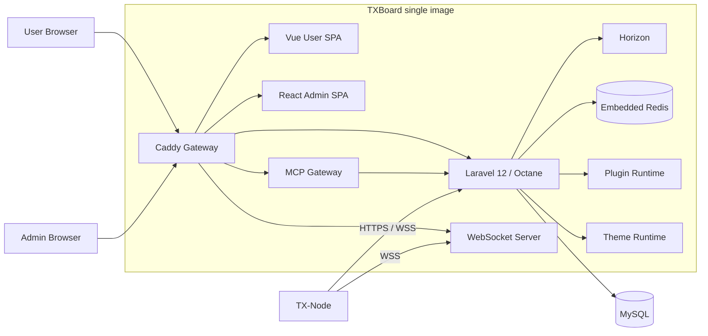

# TXBoard

> 面向用户、订阅、网络节点、扩展模块与 AI 原生运维的模块化 Control Plane。  
> TXBoard 是独立维护的控制面产品，应用、运行时、部署与扩展接口统一使用 TXBoard 命名空间。

TXBoard 负责用户、订阅、订单、支付、节点、机器、流量、工单、内容、主题与插件等控制面能力。节点运行时不再内嵌在本仓库中，而由独立的 [TX-Node](https://github.com/ANRCM0/TX-Node) 提供，通过 HTTP / WebSocket 协议与 TXBoard 通信。

当前生产部署采用 **单 TXBoard 应用镜像**：

```text
ghcr.io/anrcm0/txboard
```

一个 `txboard` 容器同时包含 Admin/User 前端、Caddy、Laravel Octane、Horizon、Redis、WebSocket 服务，以及默认关闭的 MCP Gateway。MySQL 与备份任务作为基础设施服务独立运行。

## 当前项目状态

截至 2026 年 9 月，仓库的代码与契约基线如下；这描述实现状态，不代表所有部署实例已经升级：

| 范围 | 状态与边界 |
| --- | --- |
| Core 控制面 | 用户、订阅、订单、节点、机器和路由等仍由 Laravel API 持有事实来源；TX-Node 在独立仓库，通过版本化 HTTP / WebSocket 契约通信。 |
| Module Platform v1 | A–H 阶段完成；Module Package、Registry、Lifecycle、Theme Package、Module Center、管理 API、后台导航与 Agent Ops 健康投影均已落地。当前工作是兼容性加固与缺陷修复。 |
| 扩展运行时 | PluginManager 和 ThemeService 保持权威；Registry 只负责只读发现，ModuleLifecycle 通过专门适配器执行支持的操作。第三方插件无需迁移到新清单或改造 Admin 源码。 |
| Agent Ops / MCP | MCP 为可选协议适配器，调用 Agent Ops API；操作继续经过权限、目标范围、审批和审计，不直接访问数据库、Redis 或 TX-Node。 |
| 交付与验证 | `api/tests` 覆盖 PHP 契约和业务接口；根目录 `npm run verify:web` 覆盖两个前端的类型检查、测试、构建和性能预算。CI 分别验证 API、Web、MCP 与生产镜像。 |

下一步优先处理 v1 兼容问题、故障隔离和有明确契约依据的产品改进；破坏性扩展需要单独的版本化架构提案。

---

## 主要能力

### 控制面

- 用户、订阅与套餐管理
- 订单、支付、优惠券与礼品卡
- 节点、机器、节点组与路由管理
- 流量统计、流量重置与排行榜
- 工单、公告与知识库
- 邮件、Telegram 与通知能力
- 管理员审计日志
- 动态后台安全路径 `secure_path`

### 节点与协议

- 独立 TX-Node Agent / Data Plane
- HTTP 基线控制协议
- WebSocket 实时控制通道
- Machine / Agent / Node 分层模型
- UniProxy V1 兼容接口
- V2 Machine / Server 协议
- 可选 AccessAudit 节点审计扩展

### 扩展体系

**Module Platform v1 已完成 A–H 阶段，当前进入稳定化与兼容性加固。** Registry 将 Plugin、Theme 和 Agent Ops 归一为只读库存、健康状态与后台导航；受控管理 API 通过 ModuleLifecycle 委托现有 PluginManager / ThemeService，不重新实现生命周期。Agent Ops / MCP 仍通过既有权限、目标范围、审批与审计链路，不是第二控制面。详见 [Module Platform v1](docs/architecture/module-platform-v1.md) 与 [开发指南](docs/architecture/module-platform-development-guide.md)。

- **Theme System**：默认系统主题为 TXBoard，支持安装、切换和配置自定义主题
- **Plugin System**：支持核心插件、第三方 ZIP、Schema 驱动 UI，以及 Plugin Package v1 自带 Admin App
- **AccessAudit**：独立官方插件仓库 [TXBoard-AccessAudit](https://github.com/ANRCM0/TXBoard-AccessAudit)，作为 Plugin Package v1 参考实现
- 支付、通知等能力可通过插件继续扩展

---

## 架构



TXBoard 是 **Control Plane**，TX-Node 是独立的 **Agent / Data Plane**。两个仓库之间只共享协议契约，不互相导入源码，也不互相参与构建。

### Machine、Agent 与 Node

```text
Machine
└── Agent (TX-Node process)
    ├── Node A
    ├── Node B
    └── Node C
```

- **Machine**：实际主机或运行环境
- **Agent**：运行在 Machine 上的 TX-Node 进程
- **Node**：由 Agent 承载和管理的代理服务实例
- **Panel**：TXBoard Control Plane

---

## 技术栈

| 层 | 技术 |
| --- | --- |
| Admin | React + TypeScript + Vite |
| User | Vue + TypeScript + Vite |
| API | Laravel 12 + PHP 8.2 |
| Application Server | Laravel Octane + Swoole |
| Queue | Laravel Horizon |
| Cache / Queue Backend | Redis |
| Database | MySQL 8 |
| Gateway | Caddy |
| Runtime | Docker Compose |
| Node Agent | Independent TX-Node repository |

---

## 快速部署

生产用户通过独立公开仓库 [TXBoard-Deploy](https://github.com/ANRCM0/TXBoard-Deploy) 部署。部署脚本只拉取 TXBoard 镜像，不 clone、不构建本仓库源码。

服务器只需要：

- Docker Engine
- Docker Compose v2
- Linux amd64 / arm64

交互式安装：

```bash
curl -fsSL https://raw.githubusercontent.com/ANRCM0/TXBoard-Deploy/main/install.sh | sudo bash
```

安装器会询问镜像标签、域名/TLS 模式、管理员邮箱、端口、安装目录与备份保留数量，然后生成运行时 Compose 和配置，并直接拉取：

```text
ghcr.io/anrcm0/txboard:<tag>
```

用户服务器不需要 Git、PHP、Composer、Node.js、npm 或 TXBoard 源码。

完整安装与更新说明见：

[TXBoard-Deploy](https://github.com/ANRCM0/TXBoard-Deploy)

### 维护者源码部署

本仓库根目录仍保留开发/维护用途的 Compose：

```bash
cp .env.example .env
cp api/.env.example api/.env
docker compose up -d --build --remove-orphans --wait
docker compose exec -it txboard php artisan txboard:install
```

---

## Docker 部署模型

生产分发边界：

```text
TXBoard source / CI
        │
        ▼
ghcr.io/anrcm0/txboard
        │
        ▼
TXBoard-Deploy
        │
        ▼
user server
```

TXBoard 应用镜像包含：

```text
txboard
├── Caddy
├── React Admin
├── Vue User
├── Laravel / Octane
├── Horizon
├── Redis
├── WebSocket
└── MCP Gateway（默认关闭）
```

MySQL 和备份任务由 TXBoard-Deploy 生成的 Compose 作为基础设施服务运行。

部署仓库只依赖稳定运行接口：

- TXBoard image
- `GET /api/health`
- `php artisan txboard:install`
- `php artisan txboard:install-status`

它不依赖本仓库源码目录结构。

---

## 健康检查与安装状态

TXBoard 容器健康状态同时验证：

- 内置 Redis 可响应；
- Laravel / Octane worker 能实际返回 `GET /api/health = 200`。

因此 Redis 正常但 Octane 崩溃时，容器会正确显示为 `unhealthy`，不会再出现 API 已经 502 但 Docker 仍显示 healthy 的情况。

安装状态以**数据库中真实存在管理员账号**为准，`.env` 中的 `INSTALLED` 只作为持久化标记。若出现旧标记与数据库不一致，重新执行：

```bash
docker compose exec -T txboard php artisan txboard:install
```

安装命令会自动修复标记并补齐基础设置（`secure_path`、`app_name`、`app_url`）。

---

## 更新

生产部署通过 TXBoard-Deploy 更新镜像：

```bash
curl -fsSL https://raw.githubusercontent.com/ANRCM0/TXBoard-Deploy/main/update.sh | sudo bash
```

更新器默认先做一次备份，然后拉取当前配置的 TXBoard 镜像并等待真实应用 healthcheck 通过。

维护者从源码更新：

```bash
git pull
docker compose up -d --build --remove-orphans --wait
```

TXBoard 不在运行中的容器里执行 `git reset` / `composer install` 式源码自更新。

---

## HTTPS

### Caddy 自动 HTTPS

在根目录 `.env` 中设置：

```env
TXBOARD_SITE_ADDRESS=panel.example.com
```

随后确保 DNS 指向服务器，并开放 80 / 443。

Laravel 配置：

```env
APP_URL=https://panel.example.com
SESSION_SECURE_COOKIE=true
```

### 外部反向代理

如果 HTTPS 由 Cloudflare、1Panel、aaPanel、Nginx 或其他入口终止：

```env
TXBOARD_SITE_ADDRESS=
```

然后将域名反向代理到 TXBoard 对外 HTTP 端口即可。

---

## 备份

内置 `backup` 服务会同时备份：

- MySQL 数据库
- `api/.env`（包含 APP_KEY）
- `storage/app` 上传数据
- 备份 Manifest

手动备份：

```bash
docker compose run --rm backup
```

默认输出到：

```text
backups/
```

数据库和 APP_KEY 必须一起保存，否则加密字段无法恢复。

---

## Theme System

TXBoard **保留主题体系**，主题不是临时兼容代码。

当前有两层：

1. `api/theme/`：随项目发布的 TXBoard 系统主题
2. `api/storage/theme/`：用户安装的主题

后台支持主题发现、ZIP 上传、切换、配置与删除。

现代 User SPA 位于 `web/user/`。历史默认品牌值由数据库 migration 一次性迁移到 TXBoard；运行时不再保留旧主题命名别名。后续主题系统可以继续向“统一 Theme Package”演进。

---

## Plugin System

插件是 TXBoard 的正式扩展边界。

### 核心插件

位于：

```text
api/plugins-core/
```

包含支付、Telegram 等核心扩展。

### 用户插件

运行时目录：

```text
api/plugins/
```

### Plugin Package v1

独立插件可以把完整发布包上传到 TXBoard。复杂后台页面放在插件自己的：

```text
admin/dist/
```

TXBoard Admin 通过同源 iframe + Admin Bridge 承载它，不需要把插件 React/Vue 源码编译进 TXBoard。

通用 Plugin Runtime 支持：

- Settings Schema
- CRUD Schema
- Plugin-owned Admin App
- Plugin Menu
- Legacy component / embed compatibility

复杂插件源码不进入 TXBoard Core。官方参考插件 [TXBoard-AccessAudit](https://github.com/ANRCM0/TXBoard-AccessAudit) 已独立发布；它的 Dashboard / Analytics、后端、迁移和发布 ZIP 都由插件仓库自行维护。

插件规范与开发指南：

- [Plugin Package Contract](contracts/plugin-package/README.md)
- [Plugin Development Guide](api/docs/en/development/plugin-development-guide.md)

---

## Agent Ops / MCP

Agent Ops API 属于 TXBoard Core 控制面；MCP 只是可选协议适配器。生产镜像已经内置 MCP Gateway，但默认不启动。

源码 Compose 可通过：

```env
TXBOARD_ENABLE_MCP=true
```

启用同域 MCP 入口：

```text
https://panel.example.com/mcp
```

MCP 进程只监听容器 loopback，并继续通过 Agent Ops HTTP API 执行权限、target scope、approval 与 audit。它不会直接连接 MySQL、Redis、TX-Node、SSH、Docker 或通用 Shell。

历史 `docker compose --profile mcp up -d` 方式仍保留为兼容路径，并复用同一个 TXBoard 镜像。

---

## TX-Node

TX-Node 已从 TXBoard 仓库完全拆分：

[github.com/ANRCM0/TX-Node](https://github.com/ANRCM0/TX-Node)

TXBoard 不构建、不发布、也不运行 TX-Node。

核心协议包括：

```text
POST /api/v2/server/handshake
POST /api/v2/server/report
GET  /api/v2/server/config
GET  /api/v2/server/user
POST /api/v2/server/machine/nodes
POST /api/v2/server/machine/status
```

同时保留必要的 UniProxy V1 兼容接口。

完整契约：

[TX-Node Protocol Contract](contracts/node-protocol/README.md)

---

## AccessAudit

AccessAudit 是可选的面板插件，不属于 TX-Node 核心协议。

它提供：

- 审计规则
- 命中记录
- 节点健康状态
- 分析与排行榜
- 用户封禁 / 解封
- Telegram 告警
- 可选 TX-Node audit reporter
- Xray legacy sidecar compatibility

独立仓库：

[TXBoard-AccessAudit](https://github.com/ANRCM0/TXBoard-AccessAudit)

AccessAudit 的后端、数据库迁移、Admin App 与发布生命周期均由独立仓库维护。TXBoard 镜像不再内置或覆盖 AccessAudit。

新安装请从 AccessAudit Releases 下载插件 ZIP，然后在 TXBoard 后台 **插件管理 → 上传插件 → 安装 → 启用**。

从旧版 TXBoard 升级时，已有的 `api/plugins/AccessAudit` 不会被主动删除；升级主程序不会再自动同步或覆盖该目录。

---

## API 与后台安全路径

公共 API：

```text
/api/v1/*
```

管理后台页面：

```text
/{secure_path}/
/{secure_path}/config/system
```

Admin API：

```text
/api/v2/{secure_path}/*
```

`secure_path` 同时作为管理页面入口和 Admin API 前缀，并由运行时中间件逐请求校验。固定路径 `/admin` 不再提供管理后台；修改安全路径后，前端会切换到新地址，旧页面路径与旧 API 前缀都会立即返回 404，不需要重启 Octane、Caddy 或容器。

后台前端的 JavaScript/CSS 使用内部静态命名空间 `/.txboard-admin/assets/*` 分发，但该命名空间不提供 `index.html`，不能作为管理页面入口。

管理员 POST 操作会进入审计日志；密码、Token、Secret、API Key 等敏感字段会递归脱敏后再持久化。

---

## 本地开发

### Web

```bash
npm install
npm run verify:web
```

单独开发：

```bash
npm run dev --workspace @txboard/admin
npm run dev --workspace @txboard/user
```

### API

```bash
cd api
cp .env.example .env
composer install
php artisan key:generate
php artisan migrate
php artisan test
```

根目录也提供统一验证：

```bash
make verify
```

---

## 仓库结构

```text
TXBoard/
├── api/                         Laravel Control Plane
│   ├── app/
│   ├── plugins-core/            内置插件
│   ├── theme/                   系统主题
│   └── storage/theme/           用户主题
│
├── web/
│   ├── admin/                   React Admin
│   ├── user/                    Vue User
│   └── shared/
│
├── contracts/
│   ├── http/
│   ├── node-protocol/
│   └── plugin-package/
│
├── docs/
│   ├── architecture/
│   └── archive/
│
├── Dockerfile                   单 TXBoard 镜像
├── compose.yaml                 官方部署入口
├── backup.sh
└── sync-gateway.sh
```

---

## 文档

- [Architecture](docs/architecture/README.md)
- [HTTP Compatibility Audit](contracts/http/txboard-api-compatibility-audit.md)
- [TX-Node Protocol](contracts/node-protocol/README.md)
- [Plugin Development Guide](api/docs/en/development/plugin-development-guide.md)
- [TXBoard-Deploy](https://github.com/ANRCM0/TXBoard-Deploy)
- [TXBoard-AccessAudit](https://github.com/ANRCM0/TXBoard-AccessAudit)
- [Historical Web Notes](docs/archive/)

`docs/archive/` 中的内容仅用于保存历史实现记录，不代表当前架构。

---

## CI 与镜像

主要 CI：

- `api-ci`：Laravel API 测试
- `web-ci`：Admin/User 前端验证
- `txboard-image`：Compose 校验、真实 Docker runtime smoke、多架构镜像构建与 GHCR 发布

生产镜像标签：

```text
ghcr.io/anrcm0/txboard:latest
ghcr.io/anrcm0/txboard:sha-<commit>
```

API 与两个前端作为同一个 artifact 构建，避免版本漂移。

生产部署脚本独立维护在公开的 [TXBoard-Deploy](https://github.com/ANRCM0/TXBoard-Deploy)，应用源码仓库与部署分发不再耦合。


---

## License & Provenance

TXBoard 的 API 部分源自 Xboard，并继续保留原 MIT License，详见：

- [api/LICENSE](api/LICENSE)
- [THIRD_PARTY_NOTICES.md](THIRD_PARTY_NOTICES.md)

TX-Node 是独立仓库，拥有独立的版本与发布生命周期。
