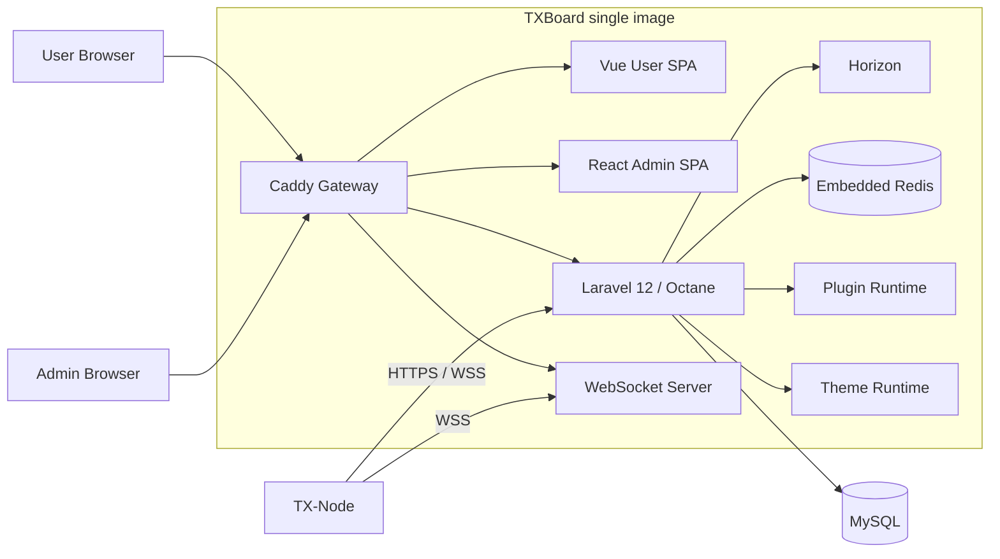

# TXBoard

> 面向代理服务与节点网络的现代化 Control Plane。  
> 基于 Xboard 演进，保留兼容能力，同时将前端、节点、主题、插件和部署体系重新拆分为清晰的边界。

TXBoard 负责用户、订阅、订单、支付、节点、机器、流量、工单、内容、主题与插件等控制面能力。节点运行时不再内嵌在本仓库中，而由独立的 [TX-Node](https://github.com/PaiMonCai/TX-Node) 提供，通过 HTTP / WebSocket 协议与 TXBoard 通信。

当前生产部署采用 **单 TXBoard 应用镜像**：

```text
ghcr.io/paimoncai/txboard
```

一个 `txboard` 容器同时包含 Admin/User 前端、Caddy、Laravel Octane、Horizon、Redis 和 WebSocket 服务。MySQL 与备份任务作为基础设施服务独立运行。

---

## 主要能力

### 控制面

- 用户、订阅与套餐管理
- 订单、支付、优惠券与礼品卡
- 节点、机器、节点组与路由管理
- 流量统计、流量重置与排行榜
- 工单、公告与知识库
- 邮件、Telegram 与通知能力
- 管理员审计日志
- 动态后台安全路径 `secure_path`

### 节点与协议

- 独立 TX-Node Agent / Data Plane
- HTTP 基线控制协议
- WebSocket 实时控制通道
- Machine / Agent / Node 分层模型
- UniProxy V1 兼容接口
- V2 Machine / Server 协议
- 可选 AccessAudit 节点审计扩展

### 扩展体系

- **Theme System**：保留 Xboard 兼容主题，同时支持安装、切换和配置自定义主题
- **Plugin System**：支持核心插件、第三方 ZIP、Schema 驱动 UI，以及 Plugin Package v1 自带 Admin App
- **AccessAudit**：Plugin Package v1 参考插件，提供规则、命中记录、分析与封禁能力
- 支付、通知等能力可通过插件继续扩展

---

## 架构



TXBoard 是 **Control Plane**，TX-Node 是独立的 **Agent / Data Plane**。两个仓库之间只共享协议契约，不互相导入源码，也不互相参与构建。

### Machine、Agent 与 Node

```text
Machine
└── Agent (TX-Node process)
    ├── Node A
    ├── Node B
    └── Node C
```

- **Machine**：实际主机或运行环境
- **Agent**：运行在 Machine 上的 TX-Node 进程
- **Node**：由 Agent 承载和管理的代理服务实例
- **Panel**：TXBoard Control Plane

---

## 技术栈

| 层 | 技术 |
| --- | --- |
| Admin | React + TypeScript + Vite |
| User | Vue + TypeScript + Vite |
| API | Laravel 12 + PHP 8.2 |
| Application Server | Laravel Octane + Swoole |
| Queue | Laravel Horizon |
| Cache / Queue Backend | Redis |
| Database | MySQL 8 |
| Gateway | Caddy |
| Runtime | Docker Compose |
| Node Agent | Independent TX-Node repository |

---

## 快速部署

### 环境要求

- Docker Engine 24+
- Docker Compose v2
- 建议至少 2 vCPU / 2 GB RAM
- 如由 TXBoard 自己签发 HTTPS，服务器需要开放 80 / 443 并正确配置 DNS

### 1. 获取项目

```bash
git clone https://github.com/PaiMonCai/TXBoard.git
cd TXBoard
```

### 2. 准备配置

```bash
cp .env.example .env
cp api/.env.example api/.env
```

编辑根目录 `.env`，至少设置：

```env
TXBOARD_DB_PASSWORD=change-me
TXBOARD_DB_ROOT_PASSWORD=change-root-password
```

根目录 `.env` 负责 Docker Stack；`api/.env` 负责 Laravel 应用配置。

### 3. 启动

使用当前源码构建：

```bash
docker compose up -d --build --remove-orphans --wait
```

使用已发布镜像：

```bash
docker compose pull txboard
docker compose up -d --remove-orphans --wait
```

### 4. 初始化

```bash
docker compose exec -it txboard php artisan xboard:install
```

安装器会完成数据库迁移并创建第一个管理员，同时输出管理员密码与 `secure_path`。

---

## Docker 部署模型

仓库根目录就是完整部署入口：

```text
TXBoard/
├── Dockerfile
├── compose.yaml
├── .env.example
├── backup.sh
├── sync-gateway.sh
├── api/
├── web/
├── integrations/
├── contracts/
└── docs/
```

Compose 中只有一个 TXBoard 应用服务：

```text
txboard
├── Caddy
├── React Admin
├── Vue User
├── Laravel / Octane
├── Horizon
├── Redis
└── WebSocket
```

另外的 `database` 和 `backup` 只是基础设施服务，并不是第二套 TXBoard 应用镜像。

### 常用命令

```bash
# 状态
docker compose ps

# 日志
docker compose logs -f txboard

# Shell
docker compose exec txboard sh

# Laravel
docker compose exec txboard php artisan about

# 重启应用
docker compose restart txboard

# 停止
docker compose down
```

不要随意执行：

```bash
docker compose down -v
```

它会删除 MySQL、Redis 和 Caddy 等命名卷。

---

## 更新

TXBoard 不再支持在运行中的容器里执行 `git reset` / `composer install` 式自更新。

### 从源码更新

```bash
git pull
docker compose up -d --build --remove-orphans --wait
```

### 使用发布镜像更新

```bash
docker compose pull txboard
docker compose up -d --remove-orphans --wait txboard
```

应用启动时仍会执行必要的数据库迁移、默认插件检查与主题刷新，但不会修改容器内源码。

---

## HTTPS

### Caddy 自动 HTTPS

在根目录 `.env` 中设置：

```env
TXBOARD_SITE_ADDRESS=panel.example.com
```

随后确保 DNS 指向服务器，并开放 80 / 443。

Laravel 配置：

```env
APP_URL=https://panel.example.com
SESSION_SECURE_COOKIE=true
```

### 外部反向代理

如果 HTTPS 由 Cloudflare、1Panel、aaPanel、Nginx 或其他入口终止：

```env
TXBOARD_SITE_ADDRESS=
```

然后将域名反向代理到 TXBoard 对外 HTTP 端口即可。

---

## 备份

内置 `backup` 服务会同时备份：

- MySQL 数据库
- `api/.env`（包含 APP_KEY）
- `storage/app` 上传数据
- 备份 Manifest

手动备份：

```bash
docker compose run --rm backup
```

默认输出到：

```text
backups/
```

数据库和 APP_KEY 必须一起保存，否则加密字段无法恢复。

---

## Theme System

TXBoard **保留主题体系**，主题不是临时兼容代码。

当前有两层：

1. `api/theme/`：随项目发布的系统主题与 Xboard 兼容主题
2. `api/storage/theme/`：用户安装的主题

后台支持主题发现、ZIP 上传、切换、配置与删除。

现代 User SPA 位于 `web/user/`，而 Xboard legacy theme 仍作为兼容路径存在。后续主题系统可以继续向“统一 Theme Package”演进，而不需要删除 Theme Runtime。

---

## Plugin System

插件是 TXBoard 的正式扩展边界。

### 核心插件

位于：

```text
api/plugins-core/
```

包含支付、Telegram 等核心扩展。

### 用户插件

运行时目录：

```text
api/plugins/
```

### Plugin Package v1

独立插件可以把完整发布包上传到 TXBoard。复杂后台页面放在插件自己的：

```text
admin/dist/
```

TXBoard Admin 通过同源 iframe + Admin Bridge 承载它，不需要把插件 React/Vue 源码编译进 TXBoard。

通用 Plugin Runtime 支持：

- Settings Schema
- CRUD Schema
- Plugin-owned Admin App
- Plugin Menu
- Legacy component / embed compatibility

`integrations/AccessAudit/` 目前保留为 Plugin Package v1 的第一方参考包；其 Dashboard / Analytics 已经完全属于插件自身，不再存在于 TXBoard Admin 编译产物中。等官方外部插件仓库建立后，这个参考包可以机械迁出而无需再改宿主前端。

插件规范与开发指南：

- [Plugin Package Contract](contracts/plugin-package/README.md)
- [Plugin Package Contract](contracts/plugin-package/README.md)
- [Plugin Development Guide](api/docs/en/development/plugin-development-guide.md)

---

## TX-Node

TX-Node 已从 TXBoard 仓库完全拆分：

[github.com/PaiMonCai/TX-Node](https://github.com/PaiMonCai/TX-Node)

TXBoard 不构建、不发布、也不运行 TX-Node。

核心协议包括：

```text
POST /api/v2/server/handshake
POST /api/v2/server/report
GET  /api/v2/server/config
GET  /api/v2/server/user
POST /api/v2/server/machine/nodes
POST /api/v2/server/machine/status
```

同时保留必要的 UniProxy V1 兼容接口。

完整契约：

[TX-Node Protocol Contract](contracts/node-protocol/README.md)

---

## AccessAudit

AccessAudit 是可选的面板插件，不属于 TX-Node 核心协议。

它提供：

- 审计规则
- 命中记录
- 节点健康状态
- 分析与排行榜
- 用户封禁 / 解封
- Telegram 告警
- 可选 TX-Node audit reporter
- Xray legacy sidecar compatibility

当前参考插件包：

[AccessAudit](integrations/AccessAudit/README.md)

AccessAudit 的复杂 Admin UI 已由插件自己的 `admin/dist` 提供；TXBoard Admin 不再包含 AccessAudit 专属 React renderer。

---

## API 与后台安全路径

公共 API：

```text
/api/v1/*
```

Admin API：

```text
/api/v2/{secure_path}/*
```

`secure_path` 由运行时中间件逐请求校验。修改后台安全路径后，新路径立即生效，旧路径立即返回 404，不需要重启 Octane 或容器。

管理员 POST 操作会进入审计日志；密码、Token、Secret、API Key 等敏感字段会递归脱敏后再持久化。

---

## 本地开发

### Web

```bash
npm install
npm run verify:web
```

单独开发：

```bash
npm run dev --workspace @txboard/admin
npm run dev --workspace @txboard/user
```

### API

```bash
cd api
cp .env.example .env
composer install
php artisan key:generate
php artisan migrate
php artisan test
```

根目录也提供统一验证：

```bash
make verify
```

---

## 仓库结构

```text
TXBoard/
├── api/                         Laravel Control Plane
│   ├── app/
│   ├── plugins-core/            内置插件
│   ├── theme/                   系统 / 兼容主题
│   └── storage/theme/           用户主题
│
├── web/
│   ├── admin/                   React Admin
│   ├── user/                    Vue User
│   └── shared/
│
├── integrations/
│   └── AccessAudit/             Plugin Package v1 第一方参考包
│
├── contracts/
│   ├── http/
│   └── node-protocol/
│
├── docs/
│   ├── architecture/
│   └── archive/
│
├── Dockerfile                   单 TXBoard 镜像
├── compose.yaml                 官方部署入口
├── backup.sh
└── sync-gateway.sh
```

---

## 文档

- [Architecture](docs/architecture/README.md)
- [HTTP Contract Audit](contracts/http/xboard-api-contract-audit.md)
- [TX-Node Protocol](contracts/node-protocol/README.md)
- [Plugin Development Guide](api/docs/en/development/plugin-development-guide.md)
- [AccessAudit](integrations/AccessAudit/README.md)
- [Historical Web Notes](docs/archive/)

`docs/archive/` 中的内容仅用于保存历史实现记录，不代表当前架构。

---

## CI 与镜像

主要 CI：

- `api-ci`
- `web-ci`
- `txboard-image`
- `pages-preview`

生产镜像：

```text
ghcr.io/paimoncai/txboard:latest
ghcr.io/paimoncai/txboard:sha-<commit>
```

API 与两个前端作为同一个 artifact 发布，避免版本漂移。

---

## License & Provenance

TXBoard 的 API 部分源自 Xboard，并继续保留原 MIT License，详见：

- [api/LICENSE](api/LICENSE)
- [THIRD_PARTY_NOTICES.md](THIRD_PARTY_NOTICES.md)

TX-Node 是独立仓库，拥有独立的版本与发布生命周期。
