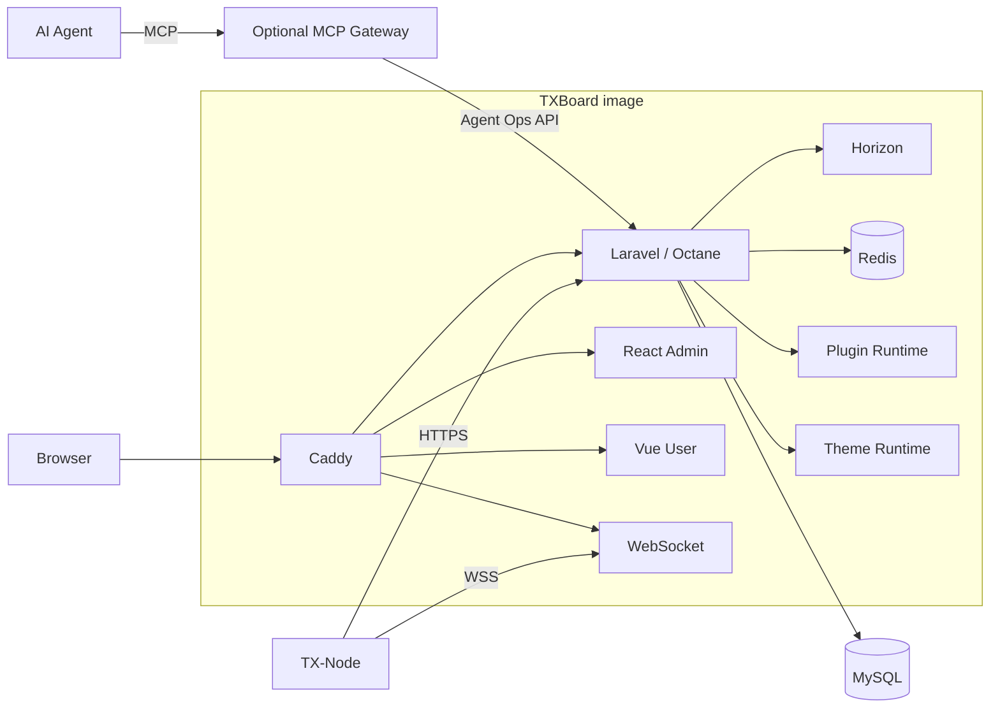

# TXBoard Architecture

TXBoard 是 Control Plane；TX-Node 是独立 Agent / Data Plane。当前仓库包含面板、前端、协议契约、主题与 Plugin Runtime，不包含 TX-Node 或可选独立插件的源码。

## Architecture roadmap

TXBoard 下一阶段的上层架构基线是 **Module Platform v1**：在不改变 Core 业务事实来源的前提下，将现有 Theme、Plugin 与 Agent Ops / MCP 通过统一 Module Registry、Capability Registry、Health 和 Admin 扩展契约进行收敛。

- [Module Platform v1](./module-platform-v1.md)：下一版目标架构、Core/Module 边界、Module Manifest、Registry、Capability、Health、Theme/Plugin/Agent 迁移方案与 Definition of Done；
- [Module Platform v1 开发指南](./module-platform-development-guide.md)：后续模块化 PR 的 contract-first、adapter-first、兼容、权限、Octane、安全与测试规则；
- [Code Agent 项目开发指南](../development/code-agent-project-guide.md)：Codex / Code Agent 的仓库工作流、架构边界、当前 Phase C 实施顺序与完成检查。根目录 `AGENTS.md` 提供 Agent 自动读取的执行规则。

Module Platform 是现有 Plugin / Theme / Agent Ops 架构之上的统一层，不替代它们已经稳定的 domain runtime，也不将 User、Order、Node 等 Core 领域强行插件化。

## Runtime



The MCP Gateway is optional and is not part of the core node protocol. Agent requests are mediated by TXBoard permissions, approval policy and audit before any node-scoped action is dispatched.

## Repository boundaries

### Control Plane

`api/` owns authentication, users, subscriptions, commerce, server/machine management, plugins, themes, queues and node-facing APIs.

### Frontends

- `web/admin/`: React administrator SPA.
- `web/user/`: Vue user SPA.
- Frontends depend on HTTP contracts, not Laravel implementation files.

### TX-Node

TX-Node lives in a separate repository. TXBoard never imports, builds or releases TX-Node. Compatibility is defined by `contracts/node-protocol/`.

### Themes

Theme Runtime is part of TXBoard's supported extension architecture. `api/theme/` contains system/compatibility themes; user-installed themes persist under storage.

### Plugins

- `api/plugins-core/`: bundled core plugins.
- `api/plugins/`: runtime/user plugins persisted by the deployment.
- Plugin-owned complex Admin UI belongs in `<plugin>/admin/dist/`.
- `web/admin/src/plugins/` owns only the host Bridge and exceptional host-native renderer registry; independent plugins must not require edits there.
- [TXBoard-AccessAudit](https://github.com/PaiMonCai/TXBoard-AccessAudit) is the first-party Plugin Package v1 reference implementation and lives outside this repository.

Plugin Package v1 deliberately makes plugin repositories independent of TXBoard's source tree, frontend build and application image.

### Agent Ops / MCP

TXBoard supports an optional AI operations layer that exposes narrow, auditable capabilities to external Agents.

The architecture is:

```text
AI Agent
  -> MCP Gateway
  -> TXBoard Agent Ops API
  -> permission / approval / audit
  -> TXBoard domain services
  -> Redis / WebSocket
  -> TX-Node typed operations
```

The MCP Gateway is an adapter, not a second control plane. It must not connect directly to MySQL, publish directly to Redis or open unrestricted SSH sessions to TX-Node machines.

Arbitrary shell execution is intentionally excluded. Node operations must be fixed, versioned and typed, such as kernel restart, configuration validation/reload, bounded log retrieval and bounded network diagnostics.

Agent Ops 文档分为三层：

- [Agent Ops / MCP Architecture](./agent-ops.md)：稳定架构、风险模型和运行边界；
- [Agent Ops 进度与阶段复盘](./agent-ops-progress.md)：Phase 0–5 交付、PR/commit、经验、限制和下一步；
- [Agent Ops 开发指南](./agent-ops-development-guide.md)：新增 READ / INSIGHT / OPERATE 能力的实施步骤、测试矩阵和 Definition of Done。

## Deployment boundary

Production has one TXBoard application image built by the root `Dockerfile`. It includes both SPAs, Caddy, Laravel/Octane, Horizon, embedded Redis and WebSocket.

MySQL and the backup helper are separate infrastructure services in `compose.yaml`.

## Dependency rules

1. TXBoard and TX-Node communicate only through versioned HTTP/WebSocket contracts.
2. Frontends consume APIs instead of importing backend implementation.
3. Theme and Plugin systems are supported extension layers and must not be treated as disposable legacy code.
4. Optional integrations must not become hard dependencies of the core node protocol.
5. Independent plugin repositories depend on the Plugin Package contract, not TXBoard Admin source code.
6. Production application code is replaced by image deployment; running containers do not self-update source code.
7. Cross-component compatibility knowledge belongs under `contracts/`.
8. MCP and other Agent integrations consume the Agent Ops API and must not bypass TXBoard domain services, permissions, approval policy or audit.
