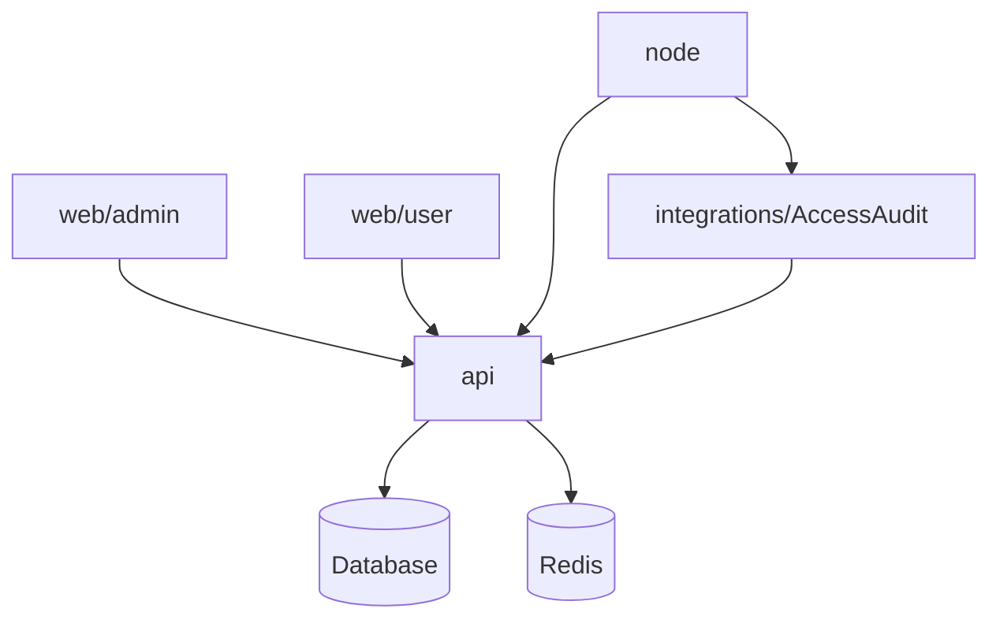

# Architecture

TXBoard uses a monorepo with independently deployable components and explicit HTTP boundaries.

## Dependency rules

1. Frontends depend on API contracts, never on API implementation files.
2. TX-Node depends on the documented node protocol, never on Laravel source code.
3. Panel plugins live under `integrations/`, not inside a runtime component.
4. Shared protocol knowledge belongs in `contracts/`.
5. Every deployable component owns its Dockerfile; root deployment files only compose components.
6. CI and releases live at repository root and use path filters.
