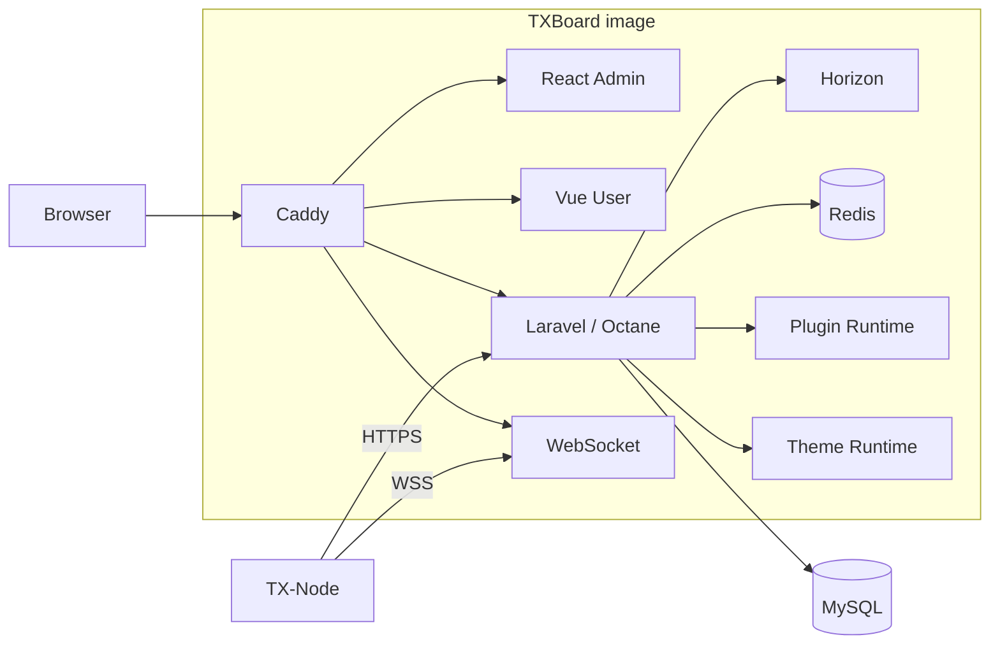

# TXBoard Architecture

TXBoard 是 Control Plane；TX-Node 是独立 Agent / Data Plane。当前仓库包含面板、前端、协议契约、主题与 Plugin Runtime，不包含 TX-Node 或可选独立插件的源码。

## Runtime

## Repository boundaries

### Control Plane

`api/` owns authentication, users, subscriptions, commerce, server/machine management, plugins, themes, queues and node-facing APIs.

### Frontends

- `web/admin/`: React administrator SPA.
- `web/user/`: Vue user SPA.
- Frontends depend on HTTP contracts, not Laravel implementation files.

### TX-Node

TX-Node lives in a separate repository. TXBoard never imports, builds or releases TX-Node. Compatibility is defined by `contracts/node-protocol/`.

### Themes

Theme Runtime is part of TXBoard's supported extension architecture. `api/theme/` contains system/compatibility themes; user-installed themes persist under storage.

### Plugins

- `api/plugins-core/`: bundled core plugins.
- `api/plugins/`: runtime/user plugins persisted by the deployment.
- Plugin-owned complex Admin UI belongs in `<plugin>/admin/dist/`.
- `web/admin/src/plugins/` owns only the host Bridge and exceptional host-native renderer registry; independent plugins must not require edits there.
- [TXBoard-AccessAudit](https://github.com/PaiMonCai/TXBoard-AccessAudit) is the first-party Plugin Package v1 reference implementation and lives outside this repository.

Plugin Package v1 deliberately makes plugin repositories independent of TXBoard's source tree, frontend build and application image.

## Deployment boundary

Production has one TXBoard application image built by the root `Dockerfile`. It includes both SPAs, Caddy, Laravel/Octane, Horizon, embedded Redis and WebSocket.

MySQL and the backup helper are separate infrastructure services in `compose.yaml`.

## Dependency rules

1. TXBoard and TX-Node communicate only through versioned HTTP/WebSocket contracts.
2. Frontends consume APIs instead of importing backend implementation.
3. Theme and Plugin systems are supported extension layers and must not be treated as disposable legacy code.
4. Optional integrations must not become hard dependencies of the core node protocol.
5. Independent plugin repositories depend on the Plugin Package contract, not TXBoard Admin source code.
6. Production application code is replaced by image deployment; running containers do not self-update source code.
7. Cross-component compatibility knowledge belongs under `contracts/`.
