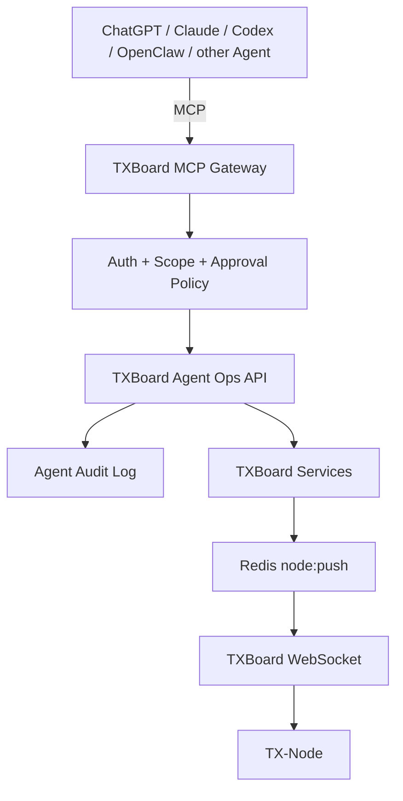

# TXBoard Agent Ops / MCP Architecture

> Status: Implemented (Agent Ops v1); Phase 5 AI-native composition remains future work
>
> Scope: TXBoard Control Plane, TX-Node operations, external Agent integrations
>
> Goal: expose safe, auditable and model-friendly operations without granting an Agent arbitrary shell access.

## 1. Overview

TXBoard Agent Ops is the AI operations layer for TXBoard.

The design separates four concerns:

1. **TXBoard Core** remains the source of truth for users, nodes, machines, configuration, metrics and permissions.
2. **Agent Ops API** exposes a stable, narrow set of operations designed for automation.
3. **MCP Gateway** maps Agent tool calls to the Agent Ops API.
4. **TX-Node** executes only versioned node-operation events delivered through the existing TXBoard control channel.

The MCP layer is an adapter, not a second control plane.



## 2. Architectural rules

These rules are mandatory.

1. **No arbitrary shell tool.** TXBoard MUST NOT expose a generic `exec(command)`, `ssh(command)` or equivalent MCP tool.
2. **Control Plane remains authoritative.** Agents do not write directly to MySQL, Redis or TX-Node local files.
3. **Reuse existing services.** Agent operations call application services such as `ServerService`, `NodeSyncService`, statistics services and future `OpsService`; they do not duplicate domain logic in the MCP server.
4. **MCP is optional.** TXBoard and TX-Node must continue to work when the MCP Gateway is absent.
5. **All state-changing actions are auditable.** Every operation records actor, client, target, parameters, result and request/correlation ID.
6. **High-risk actions require explicit approval.** Approval is enforced server-side and cannot be bypassed by prompt text.
7. **Node actions are typed events.** TX-Node only implements a fixed allow-list of versioned operations.
8. **Read and write permissions are separate.** A token allowed to inspect node health does not automatically have permission to restart or modify a node.
9. **Agent responses must be structured.** Diagnostic endpoints return normalized fields and machine-readable warnings instead of forcing the model to infer state from raw database records.

## 3. Repository boundary

TXBoard currently defines itself as the Control Plane and TX-Node as an independent Data Plane. Agent Ops follows the same boundary.

### TXBoard repository

Owns:

- Agent Ops HTTP endpoints;
- permissions/scopes;
- approval policy;
- audit records;
- normalized diagnostics;
- action dispatch to TX-Node;
- compatibility contracts;
- Admin UI for Agent access configuration and audit history.

### MCP Gateway

Preferred long-term form: an independent service/repository, tentatively **TXBoard-MCP**.

It owns:

- MCP protocol transport;
- MCP tool schemas;
- conversion between MCP requests and Agent Ops API calls;
- OAuth/Bearer-token integration where required;
- client metadata and correlation IDs.

It MUST NOT:

- connect directly to TXBoard MySQL;
- publish directly to Redis;
- open raw SSH sessions to managed machines;
- contain TXBoard business rules.

A minimal in-repository prototype is acceptable during development, but production architecture should preserve this boundary.

### TX-Node repository

Owns execution of node-scoped operations defined in the versioned node protocol, for example:

- kernel status;
- kernel restart;
- configuration validation/reload;
- bounded log retrieval;
- network diagnostics;
- service health checks.

TX-Node must reject unknown operations and validate all input locally.

## 4. Existing TXBoard capabilities to reuse

Agent Ops should build on the current control path instead of introducing a second remote-execution system.

Current building blocks include:

- `ServerService` for node state, status and metrics;
- `NodeSyncService` for Redis-backed node and machine event dispatch;
- `NodeRegistry` and the Workerman WebSocket process for active node connections;
- Horizon/system status endpoints;
- `AdminAuditLog` for existing administrative auditing;
- server/machine management controllers;
- statistics and device-state services.

The existing dispatch path is:

```text
Laravel service
  -> Redis: node:push
  -> Workerman WebSocket
  -> TX-Node
```

Agent Ops should extend this path rather than bypass it.

## 5. Agent Ops service layer

Add an application service boundary before exposing MCP operations.

Suggested namespace:

```text
api/app/Services/AgentOps/
  AgentOpsService.php
  DiagnosticService.php
  ApprovalService.php
  AuditService.php
  NodeActionService.php
```

The MCP server and Admin UI should consume stable Agent Ops endpoints instead of calling arbitrary Admin controllers.

Example internal API:

```php
$ops->getNodeHealth($nodeId);
$ops->diagnoseNode($nodeId);
$ops->requestNodeAction($actor, $nodeId, 'kernel.restart', $input);
$ops->getSystemHealth();
```

## 6. Tool risk model

Every Agent operation belongs to exactly one risk class.

### Level 1 — READ

May run automatically when the token has the required read scope.

Examples:

- system health;
- node list;
- machine list;
- node metrics;
- node online state;
- traffic summary;
- queue/Horizon health;
- audit-log lookup;
- diagnostic summaries.

### Level 2 — OPERATE

Changes runtime state but should not permanently alter business data.

Requires an operation scope and, by default, user confirmation.

Examples:

- full node sync;
- reload configuration;
- restart proxy kernel;
- run bounded ping/port/DNS diagnostics;
- clear transient device state;
- restart a controlled TX-Node service.

### Level 3 — DANGEROUS

Changes persistent configuration, access, user state or destructive resources.

Requires a dedicated high-risk scope plus explicit server-side approval.

Examples:

- modify node configuration;
- enable/disable nodes when it affects production routing;
- change user entitlement/traffic;
- rotate credentials;
- delete nodes, machines or users;
- modify authentication, billing or payment configuration.

Some operations may be permanently excluded from MCP even for administrators.

## 7. Initial MCP tool catalog

The first release should stay deliberately small.

| Tool | Risk | Purpose |
| --- | --- | --- |
| `txboard_system_status` | READ | Scheduler, Horizon and core health |
| `txboard_list_machines` | READ | Machine inventory and connection state |
| `txboard_list_nodes` | READ | Node inventory and normalized online state |
| `txboard_node_metrics` | READ | CPU, memory, disk, connections, traffic and kernel state |
| `txboard_diagnose_node` | READ | Normalized health assessment and warnings |
| `txboard_traffic_summary` | READ | Traffic and utilization summary |
| `txboard_queue_status` | READ | Queue/Horizon diagnostics |
| `txboard_audit_logs` | READ | Agent/admin operation history |
| `txboard_full_sync_node` | OPERATE | Re-push config and users |
| `txboard_reload_node_config` | OPERATE | Validate and reload runtime config |
| `txboard_restart_kernel` | OPERATE | Restart the managed proxy kernel |
| `txboard_network_test` | OPERATE | Fixed DNS/TCP port diagnostics under target policy |
| `txboard_tail_logs` | OPERATE | Approval-gated bounded/redacted TX-Node application log tail |

Do not add generic database, Redis, filesystem or shell tools.

## 8. Normalized diagnostic model

Models perform better when TXBoard provides a concise operational view rather than exposing raw records.

Example:

```json
{
  "target": {
    "type": "node",
    "id": 12,
    "name": "JP-03"
  },
  "online": true,
  "websocket": true,
  "kernel": {
    "running": false
  },
  "resources": {
    "cpu_percent": 32.1,
    "memory_percent": 48.5,
    "disk_percent": 62.3
  },
  "connections": {
    "active": 0
  },
  "traffic": {
    "inbound_bps": 0,
    "outbound_bps": 0
  },
  "last_seen_at": 1758535200,
  "warnings": [
    {
      "code": "kernel_not_running",
      "severity": "critical"
    },
    {
      "code": "no_active_connections",
      "severity": "warning"
    }
  ]
}
```

The diagnostic endpoint should distinguish facts from derived warnings. It should not invent causes when telemetry is insufficient.

## 9. Node Ops protocol

Extend `contracts/node-protocol/` with typed operation messages.

Suggested operations:

```text
ops.kernel.status
ops.kernel.restart
ops.config.validate
ops.config.reload
ops.logs.tail
ops.network.ping
ops.network.dns
ops.network.port_check
ops.service.status
ops.service.restart
ops.system.info
```

Each operation must define:

- protocol version;
- input schema;
- maximum input size;
- timeout;
- output schema;
- error codes;
- whether it mutates runtime state;
- whether it is idempotent;
- minimum TX-Node version.

An operation request should carry a correlation ID:

```json
{
  "event": "ops.kernel.restart",
  "data": {
    "node_id": 12,
    "request_id": "ops_01...",
    "reason": "agent-approved remediation"
  }
}
```

TX-Node should respond with a result event carrying the same request ID.

## 10. Approval model

Confirmation must be enforced by TXBoard, not by the language model alone.

Recommended flow:

```text
Agent requests action
  -> Agent Ops validates scope
  -> policy marks action as approval-required
  -> TXBoard creates pending action
  -> user approves in trusted UI/client
  -> TXBoard dispatches typed node action
  -> result is recorded
```

For future trusted automation, policies may allow narrow auto-remediation rules such as:

- restart kernel only when health state is unhealthy;
- maximum one automatic restart per node per configured cooldown;
- never execute destructive Level 3 actions automatically.

## 11. Authentication and scopes

Agent credentials should be independent from normal administrator browser sessions.

Suggested scopes:

```text
agent:system:read
agent:machines:read
agent:nodes:read
agent:metrics:read
agent:traffic:read
agent:audit:read

agent:nodes:sync
agent:nodes:diagnose
agent:nodes:operate

agent:nodes:write
agent:users:read
agent:users:write
agent:system:dangerous
```

Principles:

- default deny;
- short-lived access tokens where practical;
- revocable credentials;
- per-client identity;
- target restrictions implemented through token-scoped node and machine IDs;
- secrets are never returned through MCP tool outputs.

## 12. Audit requirements

Every Agent request should create a structured audit record.

Minimum fields:

```text
request_id
timestamp
actor_type
actor_id
client_id
protocol
tool
risk_level
target_type
target_id
input_redacted
approval_required
approval_actor
started_at
finished_at
result_status
result_summary
error_code
source_ip / client metadata where appropriate
```

Sensitive values such as tokens, passwords, UUID secrets and payment credentials must be redacted before persistence.

Agent audit records may reuse or extend the existing admin audit infrastructure, but Agent actions should remain independently filterable.

## 13. Agent operating loop

The preferred operational behavior is:

```text
Observe
  -> Diagnose
  -> Plan
  -> Request approval when required
  -> Execute
  -> Verify
  -> Audit
```

Example:

```text
User: "Check why JP-03 is unavailable."

Agent
  -> txboard_node_metrics
  -> txboard_diagnose_node

TXBoard
  -> online=true
  -> websocket=true
  -> kernel.running=false

Agent
  -> proposes txboard_restart_kernel

User approves

Agent
  -> txboard_restart_kernel
  -> txboard_diagnose_node

TXBoard
  -> kernel.running=true
  -> connections recovering
```

The final verification step is required for state-changing operations whenever a verification signal exists.

## 14. Safety constraints

The following are intentionally unsupported:

- arbitrary shell execution;
- arbitrary SQL;
- arbitrary Redis commands;
- unrestricted filesystem read/write;
- retrieval of raw credentials;
- arbitrary outbound HTTP requests from TX-Node;
- arbitrary package installation;
- arbitrary Docker commands.

If a future use case appears to require one of these capabilities, first create a typed, narrowly scoped operation instead.

Log retrieval must also be bounded by:

- named log sources;
- maximum line count/byte count;
- secret redaction;
- no caller-controlled filesystem path.

TX-Node v1 file logs do not encode a calendar date, so Agent Ops v1 does not claim an unreliable historical time filter. It uses a bounded tail window instead; adding trustworthy time-range filtering requires a dated log format first.

Network diagnostics must restrict destinations and protocols according to deployment policy to prevent the Agent interface from becoming a general-purpose network scanner.

## 15. Failure handling

Agent Ops actions must be safe under retries and partial failures.

Requirements:

- every state-changing request gets a unique request ID;
- idempotent operations should de-duplicate retries;
- non-idempotent actions should return the previous result when the same request ID is replayed;
- action timeout does not imply action failure;
- TXBoard records `pending / running / succeeded / failed / timed_out / unknown`;
- verification is performed separately from command acknowledgement;
- node disconnects do not silently convert a queued operation into success.

## 16. Delivery phases

### Phase 0 — Contract and documentation

- [x] Define architecture boundary.
- [x] Define risk model.
- [x] Define initial tool catalog.
- [x] Add Agent Ops HTTP contract under `contracts/http/`.
- [x] Add Node Ops protocol contract under `contracts/node-protocol/`.

### Phase 1 — Read-only Agent Ops — implemented

- [x] system status;
- [x] machine/node inventory;
- [x] metrics;
- [x] normalized node diagnostics;
- [x] traffic summary;
- [x] queue health;
- [x] read-only Agent audit endpoint.

### Phase 2 — Controlled node actions — implemented

- [x] full sync;
- [x] config validate/reload;
- [x] kernel status/restart;
- [x] bounded/redacted application logs;
- [x] bounded DNS/TCP network checks;
- [x] request IDs and result events;
- [x] timeout handling;
- [x] duplicate request-ID replay protection.

Verification remains an explicit Agent step: after a successful mutating action, the Agent should call the relevant read/diagnostic tool rather than treating command acknowledgement as proof of recovery.

### Phase 3 — MCP Gateway — implemented

- [x] Streamable HTTP MCP adapter;
- [x] authenticated Bearer requests;
- [x] one-to-one mapping to Agent Ops API;
- [x] structured tool errors;
- [x] client/protocol correlation metadata;
- [x] optional Compose `mcp` profile.

The gateway contains no direct database, Redis or node-control logic.

### Phase 4 — Approval and policy engine — implemented for v1

- [x] pending actions;
- [x] Admin approval/rejection UI;
- [x] risk classes;
- [x] per-tool functional scopes;
- [x] per-target node/machine scopes;
- [x] action cooldown;
- [x] pending-action limits per token and node;
- [x] Agent-specific audit trail.

Safe auto-remediation remains intentionally disabled in v1. Enabling it later requires an explicit policy design rather than silently bypassing approval.

### Phase 5 — AI-native operations — future/optional

Higher-level capabilities can be composed on top of the stable v1 tools, such as:

- fleet health summaries;
- anomaly explanations based on telemetry;
- incident timelines;
- guided remediation;
- post-action verification;
- scheduled fleet inspection.

These capabilities should compose the same narrow tools rather than bypassing them.

## 17. Suggested first implementation slice

The first code slice should be intentionally small:

1. introduce `AgentOpsService`;
2. expose read-only endpoints for system health, node list and node diagnostics;
3. normalize metrics already available from `ServerService`;
4. add Agent-specific scopes/authentication;
5. write structured audit entries for Agent calls;
6. define MCP schemas for the three read-only operations;
7. only after those are stable, add `ops.kernel.restart`.

This keeps the first milestone observable and safe while proving the full Agent -> MCP -> TXBoard flow.

## 18. Design decision summary

TXBoard Agent Ops is an orchestration and safety layer, not a remote shell.

The stable model is:

```text
Agent
  -> MCP Gateway
  -> TXBoard Agent Ops API
  -> permission / approval / audit
  -> TXBoard domain services
  -> Redis / WebSocket
  -> TX-Node typed operation
  -> result
  -> verification
```

This preserves the existing Control Plane/Data Plane architecture while making TXBoard usable by modern Agents without giving those Agents unrestricted infrastructure access.
