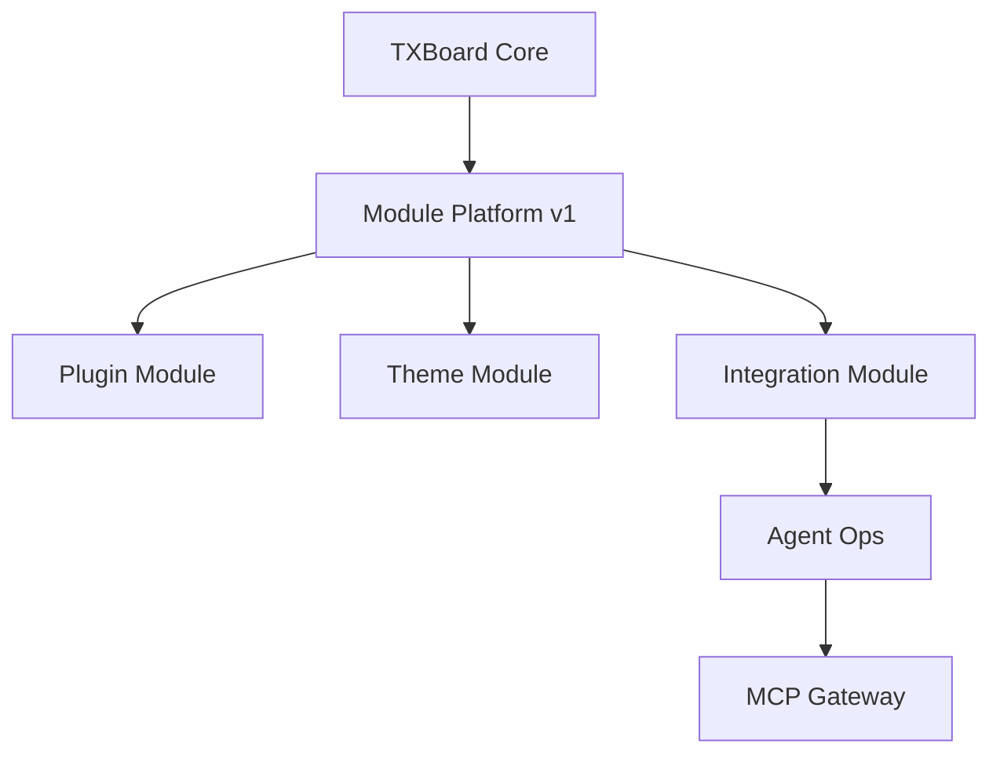

# TXBoard Module Platform v1

> Status: Active architecture baseline — implementation in progress
>
> Scope: TXBoard Core, Theme Runtime, Plugin Runtime, Admin extension host, Agent Ops / MCP integration
>
> Goal: evolve TXBoard from an extensible control panel into a modular control-plane platform without turning core business domains into plugins.

## 1. Product definition

TXBoard is evolving toward:

> **A modular control plane for users, subscriptions, network nodes, extensions and AI-native operations.**

The next architecture keeps the existing Control Plane / Data Plane split while adding a formal Module Platform inside TXBoard.



The guiding rule is:

> **Core owns product truth; Modules extend capabilities.**

### Current implementation status

Completed:

- **Phase A / PR A** — Module Package v1 contract, JSON Schema, PHP Module DTO/value objects and drift tests;
- **Phase B / PR B** — read-only Module Registry, Plugin/Theme/Agent Ops adapters, discovery isolation and read-only Admin inventory API;
- **Phase C / PR C** — Module Lifecycle v1, PluginLifecycleAdapter delegation to existing `PluginManager`, structured lifecycle result/error state and post-mutation Registry refresh.

Current implementation target:

- **Phase D** — Theme Package v1 and Theme lifecycle adapter, preserving `frontend_theme` as the single canonical active-theme state.

Important invariant:

> The Registry is currently an inventory/normalization layer. It MUST NOT become a second implementation of Plugin, Theme or Agent lifecycle behavior.

## 2. Core boundary

The following remain Core and are not targets for pluginization in Module Platform v1:

- authentication and administrator access;
- users;
- plans and subscriptions;
- orders;
- nodes, machines, groups and routes;
- TXBoard ↔ TX-Node control plane;
- base settings, audit and authorization infrastructure;
- Module Runtime itself.

These domains define what TXBoard is. Extensions may observe or augment them through stable contracts, but do not replace their source of truth.

## 3. Module types

Module Platform v1 introduces a common `Module` model.

Initial module types:

- `core` — built-in system capability; not third-party installable;
- `plugin` — backend/business extension;
- `theme` — user-facing theme package;
- `integration` — external-system or protocol integration;
- `provider` — replaceable service provider such as payment or notification;
- `agent` — AI/Agent integration capability.

A Module is described by:

- id;
- name;
- version;
- type;
- source;
- installation/enabled state;
- health;
- compatibility;
- capabilities;
- configuration;
- optional Admin integration.

## 4. Module Manifest v1

Module Platform v1 defines its stable manifest contract under:

```text
contracts/module-package/
```

See [Module Package Contract v1](../../contracts/module-package/README.md) and its canonical [JSON Schema](../../contracts/module-package/schema-v1.json).

Target shape:

```json
{
  "schema": 1,
  "module": {
    "id": "access_audit",
    "name": "Access Audit",
    "version": "1.2.0",
    "type": "plugin",
    "description": "Audit extension for TXBoard",
    "author": "Example"
  },
  "compatibility": {
    "txboard": ">=1.0.0"
  },
  "capabilities": [
    "admin.menu",
    "admin.app",
    "api.route",
    "hook.action",
    "database.migration"
  ]
}
```

Plugin Package v1 remains supported. Existing plugin manifests are adapted into the Module model instead of being forced into an immediate breaking migration.

## 5. Capability Registry

Modules must declare what they extend. Capabilities should not be inferred only from directory presence.

Initial capability namespace:

```text
admin.menu
admin.settings
admin.crud
admin.app

api.route
web.route

hook.action
hook.filter

database.migration
scheduler
command

theme

payment.provider
notification.provider

agent.api
agent.admin
```

The registry becomes the basis for Admin presentation, compatibility checks, security review, authorization, health checks, and future package trust policy.

## 6. Module Registry

A common registry will discover and normalize modules from current subsystems.

Target service boundary:

```text
ModuleManifest
ModuleRegistry
ModuleManager
ModuleCapability
ModuleCompatibility
```

Example internal model:

```json
{
  "id": "access_audit",
  "type": "plugin",
  "version": "1.2.0",
  "source": "user",
  "installed": true,
  "enabled": true,
  "health": "healthy",
  "capabilities": ["admin.app", "api.route", "database.migration"]
}
```

Admin code should eventually consume the registry instead of independently scanning themes, plugins and integrations.

## 7. Lifecycle

Module Platform v1 defines a common lifecycle vocabulary. The implemented lifecycle orchestration contract is [Module Lifecycle Contract v1](../../contracts/module-lifecycle/README.md).

```text
discover
  -> validate
  -> install
  -> enable
  -> boot
  -> running
  -> disable
  -> upgrade
  -> uninstall
```

Lifecycle events:

```text
module.installing
module.installed
module.enabling
module.enabled
module.disabling
module.disabled
module.upgrading
module.upgraded
module.uninstalling
module.uninstalled
```

Not every module type must implement every operation. For example, system themes cannot be uninstalled.

## 8. Module Health

Enabled/disabled is not sufficient operational state.

Initial health states:

```text
healthy
degraded
disabled
failed
incompatible
missing_dependency
```

A module health result may include checks such as:

```json
{
  "module": "access_audit",
  "status": "healthy",
  "checks": {
    "manifest": "ok",
    "database": "ok",
    "admin_app": "ok",
    "dependencies": "ok"
  }
}
```

This allows the Admin to distinguish `Enabled · Healthy`, `Enabled · Degraded`, `Disabled`, and `Incompatible`.

## 9. Plugin integration

The current Plugin Runtime remains the strongest implementation of the future Module Runtime.

Existing components remain valid:

- `PluginManager`;
- `AbstractPlugin`;
- `HookManager`;
- `PluginConfigService`;
- Plugin Package v1;
- Admin Bridge v1;
- schema-driven Settings / CRUD;
- plugin-owned `admin/dist`.

Module Platform v1 adds read and lifecycle adapters:

```text
Plugin Package v1
      -> PluginModuleAdapter
      -> Module Registry

ModuleLifecycle
      -> PluginLifecycleAdapter
      -> PluginManager
```

The lifecycle adapter delegates install/enable/disable/upgrade/uninstall to `PluginManager` and re-reads Registry state afterward. It does not duplicate migrations, plugin loading, boot, asset publishing or database mutations.

No Plugin Package v2 is required until the common Module model proves stable.

## 10. Theme integration

Theme Runtime becomes a first-class Module type.

The canonical active-theme setting is:

```text
frontend_theme
```

The built-in default is:

```text
TXBoard
```

Legacy `current_theme` may be read only for compatibility during migration; it must not remain a second source of truth.

Theme Package v1 should formalize identity/version, entrypoint, static assets, configuration schema, compatibility, source, active state and health.

Target layout:

```text
theme/
├── manifest.json
├── dashboard.blade.php
├── assets/
└── config.schema.json
```

## 11. Admin Module Center

A unified Admin entrypoint will be introduced:

```text
Extensions
  -> Module Center
```

It should list system modules, plugins, themes, integrations and providers.

Each module should expose name, type, version, source, enabled/active state, health, capabilities, upgrade state and management entrypoint.

Existing Theme, Plugin and Agent Ops pages may remain during v1 as specialized management surfaces.

## 12. Admin Navigation Registry

Navigation is currently declared differently by core pages, plugins and Agent Ops.

Module Platform v1 introduces a common Admin Navigation Registry.

Target declaration:

```json
{
  "admin": {
    "navigation": [
      {
        "id": "audit",
        "title": "Access Audit",
        "path": "audit",
        "icon": "shield",
        "order": 100
      }
    ]
  }
}
```

The Admin shell owns rendering and route integration.

## 13. Admin Bridge v2

Admin Bridge v1 remains compatible.

Bridge v2 may add host services such as:

```text
txboard:module:init
txboard:module:navigate
txboard:module:toast
txboard:module:confirm
txboard:module:refresh
txboard:module:open-user
txboard:module:open-node
txboard:module:open-machine
txboard:module:get-theme
```

Third-party complex Admin apps should continue to ship their own build artifacts instead of requiring changes to TXBoard Admin source.

## 14. Permissions

Module Platform v1 does not require a full RBAC rewrite.

It introduces a naming convention that future authorization can consume:

```text
module:{module}:read
module:{module}:manage
```

Agent abilities remain a dedicated model because they combine functional abilities with resource scopes and approval policy.

## 15. Agent Ops / MCP position

Agent Ops remains a system integration, not a normal third-party PHP plugin.

Its boundary stays:

```text
AI Client
  -> MCP Gateway
  -> Agent Ops API
  -> TXBoard domain services
  -> approval / audit
  -> Control Plane
  -> TX-Node typed operations
```

Module Platform only registers and describes Agent Ops capabilities. It does not move Agent domain logic into MCP or a generic plugin runtime.

The MCP Gateway remains optional and MUST NOT become a second control plane.

## 16. Security model

### PHP plugins

PHP plugins are trusted in-process extensions. Installing one is equivalent to allowing third-party application-level PHP code to execute inside TXBoard. Module Platform v1 does not claim to sandbox PHP plugins.

### Plugin Admin apps

Plugin Admin apps continue to use same-origin iframe + Admin Bridge. Path traversal, external app URLs and unsafe navigation remain rejected.

### Packages

Existing archive protections remain mandatory:

- entry-count limit;
- total extracted-size limit;
- absolute-path rejection;
- Windows drive-path rejection;
- NUL rejection;
- `..` traversal rejection;
- symlink rejection;
- manifest validation;
- declared Admin app validation.

Checksum, signatures and publisher identity are future trust-layer work, not a v1 requirement.

## 17. Delivery phases

### Phase A — Contract foundation

**Implemented.** Module Package v1 now defines Module Manifest, Descriptor, type/source/health vocabularies and Capability contract.

### Phase B — Read-only Registry foundation

**Implemented.** The read-only Module Registry now normalizes current Plugin, Theme and Agent Ops subsystems through adapters and exposes an Admin inventory API. Registry discovery does not execute lifecycle mutations.

### Phase C — Plugin lifecycle integration

**Implemented.** Module Lifecycle v1 now defines install/enable/disable/upgrade/uninstall, structured results/errors, Plugin lifecycle delegation to the existing `PluginManager`, unsupported-type behavior and post-mutation Registry refresh. No generic Module write HTTP API was added in this phase.

### Phase D — Theme package and lifecycle adapter

**Current target.** Formalize Theme Package v1, remove theme-state ambiguity and map Theme lifecycle operations through `ThemeService` while preserving `frontend_theme` as the canonical state.

### Phase E — Module Center

Build the unified Admin inventory and status page.

### Phase F — Admin Bridge v2

Add host services while keeping Bridge v1 compatible.

### Phase G — Agent integration

Register Agent Ops in the Module Registry without changing the Agent Ops security model.

## 18. Explicit non-goals

Module Platform v1 does NOT include:

- plugin/theme marketplace;
- automatic third-party downloads or updates;
- PHP sandboxing;
- package signing CA;
- full administrator RBAC rewrite;
- User / Order / Node domain pluginization;
- TXBoard Core microservices split;
- Agent auto-remediation;
- generic MCP shell/database/filesystem tools.

## 19. Definition of Done

Module Platform v1 is complete when:

1. Plugin, Theme and Agent Ops can be represented by Module Registry.
2. Every module has stable identity, type, version, source, status, health and capabilities.
3. Plugin Package v1 remains compatible.
4. Theme Package v1 has a formal contract.
5. The active theme has one canonical state source.
6. Module Center provides a unified inventory.
7. Module Health is queryable.
8. Module navigation can be supplied through a registry.
9. Admin Bridge v1 remains compatible while Bridge v2 is introduced safely.
10. Agent Ops / MCP continues to use its existing safe API boundary.
11. API/Web/Image CI covers the compatibility contract.
12. No duplicate business source of truth is introduced.

At that point TXBoard can accurately be described as a **Modular Control Plane Platform**.
